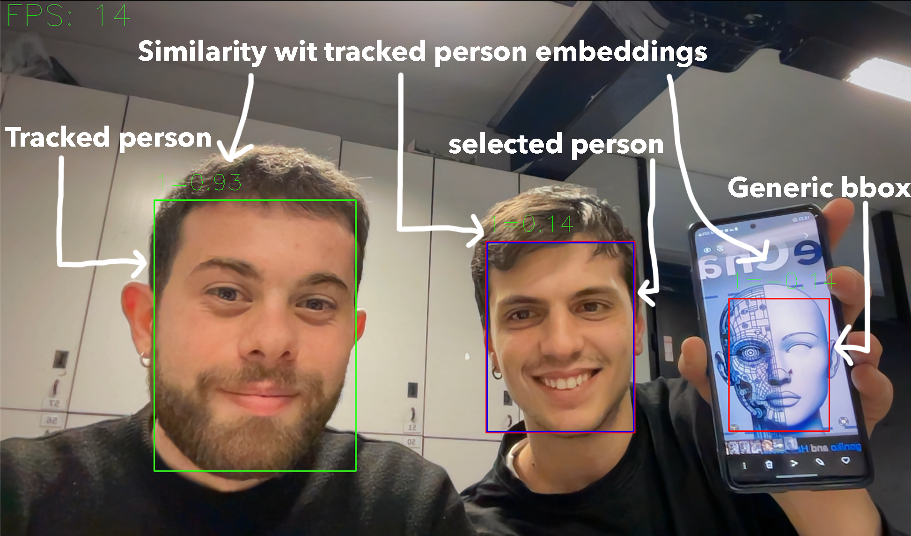
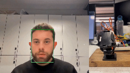

# FaceChaser
</img>
This project is a collaborative effort between [agoniko](https://github.com/agoniko) and [Habboista](https://github.com/Habboista).

## Overview

FaceChaser is a real-time video stream application for face detection and tracking. 
It allows users to select multiple individuals to track while coordinating with multiple 2DoF robotic arms for physical tracking.

Face Detection uses the RetinaFace model from the [batch_face](https://github.com/elliottzheng/batch-face) library. 

Face embeddings are extracted using the SphereFace model from the [sphereface_pytorch](https://github.com/clcarwin/sphereface_pytorch) repo or with [SFace](https://arxiv.org/pdf/2205.12010.pdf) model from the official quantized open-cv implementation for cpu inference.

Tracking employs a combination of bounding box distances and face embeddings to track faces across frames.

If you have N robotic arms you can track up to N persons simultaneously. You can also track a single person on multiple robotic arms, a system reference transformation is used to calculate the pan-tilt angles for each robotic arm with respect to their position in the room.

## Demo
### GUI explaination
</img>
</img>


## Circuit schemes
The circuit schemes below illustrate the setup for a single pan-tilt servo system. Multiple systems can be connected together. The tilt servo is connected to Digital pin 10, while the pan servo is connected to Digital pin 9 on the Arduino board. To power the servo motors, a separate 5V power supply is used to meet their current requirements, separate from the power supply for the Arduino. The ground (gnd) of the power supply is connected to the ground (gnd) of the Arduino to ensure proper control of the servo motors.
The code for the Arduino is provided in the `arduino` folder.

 Circuit Scheme </img>

## Installation
To install the required packages, run the following command:
```bash
pip install -r requirements.txt
```

## Usage
Firstly, you need to download the SphereFace model weights (file is named ) from the [repo](https://github.com/clcarwin/sphereface_pytorch/tree/master/model), extract them and place it in the `src/model` folder.

The configuration script contains reference system informations about the relative positions of objects in space (laptop, robotic arms) and camera parameters for depth estimation.

To run the configuration script:
```bash
python generate_config.py
```
This will generate a `config.json` file in the `src` folder with default parameters from the demo.

To start the application, run the following command:
```bash
python main.py
```
For testing purposes the script will run also without arduinos connected. The functionalities will be limited to just selecting a person and tracking multiple persons.

The script has the following command line arguments:
- `--device` - device for model inference `cpu|cuda|mps`
- `--rescale` - Models will make inference on a resized frame. The rescale factor is used to resize the frame. The default value is 1.0.
The higher this value the the slower the inference time but the better the accuracy (and detection distance).
- `--serial_ports` - The serial ports of the Arduino boards passed as a list separated just by a space. `(eg COM3 COM4)`
- `--similarity` - The similarity threshold for face embeddings. The default value is 0.5. The higher the value the more similar the faces need to be to be considered the same person.

### Controls
- `r` - To randomly select a person (a must when no bounding box is selected)
- `a` - To select the bounding box to the left
- `d` - To select the bounding box to the right
- `w` - To select the bounding box above
- `s` - To select the bounding box below
- `1 or 2 or ...`  - To start tracking the selected person on the i-th device
- `u` - To unset all the tracked persons


